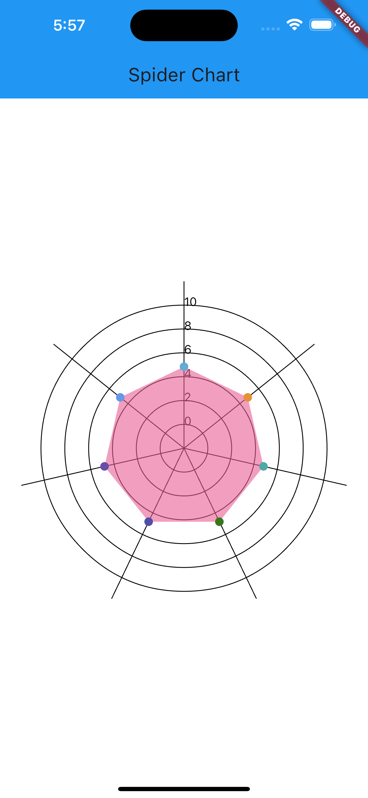

<!--
This README describes the package. If you publish this package to pub.dev,
this README's contents appear on the landing page for your package.

For information about how to write a good package README, see the guide for
[writing package pages](https://dart.dev/guides/libraries/writing-package-pages).

For general information about developing packages, see the Dart guide for
[creating packages](https://dart.dev/guides/libraries/create-library-packages)
and the Flutter guide for
[developing packages and plugins](https://flutter.dev/developing-packages).
-->

This package helps you to draw spider chart with overlay of rader. the coloring scheme is always depends on the data which pass through it.


## Features

TODO: List what your package can do. Maybe include images, gifs, or videos.

## Getting started

TODO: List prerequisites and provide or point to information on how to
start using the package.
## Example Result



## Usage

TODO: Include short and useful examples for package users. Add longer examples
to `/example` folder.

```dart
import 'package:flutter/material.dart';
import 'package:spider_chart_extended/spider_chart_extended.dart';

void main() {
  runApp(const MyApp());
}

class MyApp extends StatelessWidget {
  const MyApp({super.key});

  // This widget is the root of your application.
  @override
  Widget build(BuildContext context) {
    return MaterialApp(
      title: 'Flutter Demo',
      theme: ThemeData(
        // This is the theme of your application.
        //
        // TRY THIS: Try running your application with "flutter run". You'll see
        // the application has a blue toolbar. Then, without quitting the app,
        // try changing the seedColor in the colorScheme below to Colors.green
        // and then invoke "hot reload" (save your changes or press the "hot
        // reload" button in a Flutter-supported IDE, or press "r" if you used
        // the command line to start the app).
        //
        // Notice that the counter didn't reset back to zero; the application
        // state is not lost during the reload. To reset the state, use hot
        // restart instead.
        //
        // This works for code too, not just values: Most code changes can be
        // tested with just a hot reload.
        colorScheme: ColorScheme.fromSeed(seedColor: Colors.deepPurple),
        useMaterial3: true,
      ),
      home: Example(),
    );
  }
}

class Example extends StatelessWidget {
  Example({super.key});
  List<List<num>> data = [
    [
      5.0,
      5.0,
      5.0,
      5.0,
      5.0,
      5.0,
      5.0,
    ]
  ];
  final ticks = [0, 2, 4, 6, 8, 10, 12];
  final colorList = [
    const Color(0xff62ACD6),
    const Color(0xffE69138),
    const Color(0xff4EA8A8),
    const Color(0xff38761D),
    const Color(0xff504EA8),
    const Color(0xff674EA8),
    const Color(0xff6499E8),
  ];
  final features = [
    "General",
    "General",
    "General",
    "General",
    "General",
    "General",
    "General",

  ];

  @override
  Widget build(BuildContext context) {
    return Scaffold(
      backgroundColor: Colors.white,
      appBar: AppBar(
        backgroundColor: Colors.blue,
        title: Text("Spider Chart"),),
      body: Padding(
        padding: const EdgeInsets.all(20.0),
        child: SpiderChart(
          tickColor: colorList,
          axisColor:  Colors.black,
          ticks: ticks,
          features: features,
          data: data,
          reverseAxis: false,
        ),
      ),
    );
  }
}

```

## Additional information

TODO: Tell users more about the package: where to find more information, how to
contribute to the package, how to file issues, what response they can expect
from the package authors, and more.
# spider_chart_extended
# spider_chart_extended
